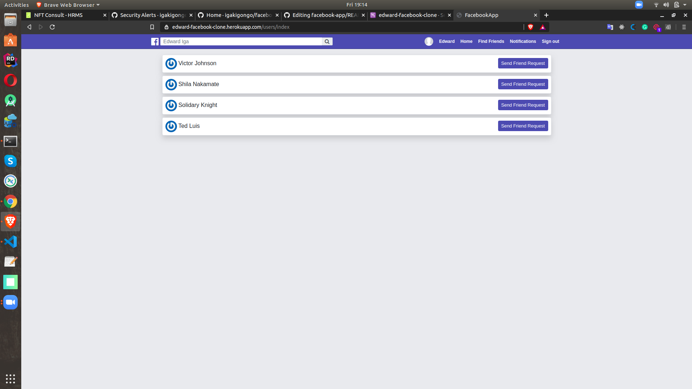
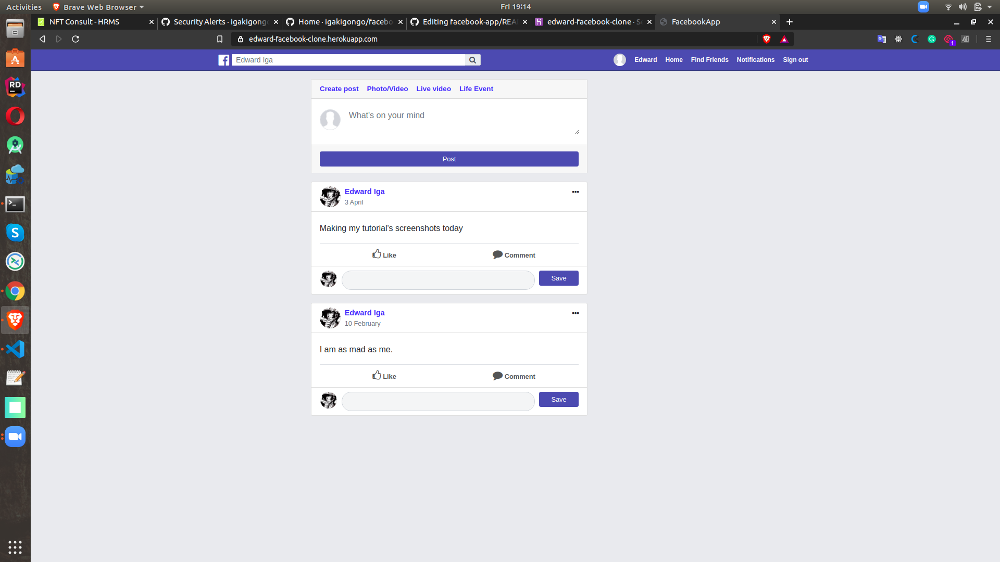

## FACEBOOK CLONE - RAILS

The purpose of the project is to create a simple clone of Facebook while focusing on the following areas:

* Associations In Rails
* Security In Rails (OAuth)
* Test Driven Development

For more information please refer to the link below

[The Odin Project: Building Facebook](https://www.theodinproject.com/courses/ruby-on-rails/lessons/final-project)

### Tasks (Pages of Interest)
- Timeline - view all posts
- Posts (With Liking and Commenting)
- Friend (Add/Remove Friends)

### Screenshots

#### Friends Page
Lists all users - you can send a request to those who are not your friends from this page

#### Posts Page
Shows a list of all posts including posts from friends, you can comment and like posts from this page

### Useful Resources

* [Active Record Associations](https://guides.rubyonrails.org/association_basics.html)
* [Devise](https://github.com/plataformatec/devise)
* [Feature Testing with Capybara](https://github.com/teamcapybara/capybara)
* [OmniAuth](https://github.com/omniauth/omniauth)

### Wiki Section
For more information about the project set up such as models and devise, please refer to my [wiki page](https://github.com/igakigongo/facebook-app/wiki)

### Contributors

* [Edward Iga Kigongo](https://github.com/igakigongo)

### Contact
* Email: igakigongo@gmail.com
* LinkedIn: https://www.linkedin.com/in/igakigongo/
* PluralSight: https://app.pluralsight.com/profile/edward-iga
